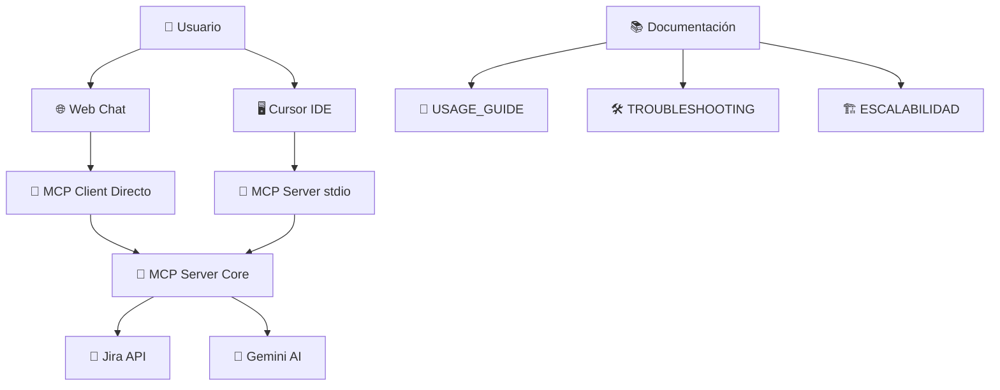

# 🚀 Jira MCP Chat - Sistema Completo de Integración

Un cliente de chat inteligente profesional que te permite interactuar con Jira usando lenguaje natural. Construido con MCP (Model Context Protocol), Next.js y Gemini AI con arquitectura escalable y documentación completa.


## ✨ Características Principales

### 🤖 **Interacción Inteligente**
- 💬 Chat natural con Jira usando Gemini AI
- 🔍 Búsqueda avanzada (JQL automático + keywords)
- 🎯 Detección inteligente de consultas
- 📊 Respuestas estructuradas y detalladas

### 🏗️ **Arquitectura Moderna**
- ⚡ **MCP Protocol**: Estándar para conectores AI
- 🔄 **Dual Mode**: Modo directo + modo stdio para Cursor
- 🏠 **Local First**: Todo corre localmente
- 🔧 **Escalable**: Agregador MCP para múltiples servicios

### 🎨 **Experiencia de Usuario**
- 🖥️ **Web Chat**: Interfaz moderna tipo Claude
- 📱 **Responsive**: Funciona en cualquier dispositivo
- ⚡ **Real-time**: Respuestas instantáneas
- 🎛️ **Control completo**: Scripts de gestión incluidos

## 🎯 Capacidades Completas

### 📋 **Gestión de Proyectos**
```bash
🔍 "Lista todos los proyectos disponibles"
📊 "Estadísticas del proyecto AIDEV"
🎯 "Issues abiertos en el proyecto SOP"
```

### 🔎 **Búsquedas Avanzadas**
```bash
🔍 "Busca AIDEV-6"                    # Issue específico
🐛 "Todos los bugs de alta prioridad"  # Por tipo y prioridad
📅 "Issues creados esta semana"        # Filtros temporales
👤 "Issues asignados a mí"            # Búsquedas personales
🔄 "Issues en progreso del proyecto X"  # Estado específico
```

### 📊 **Análisis e Insights**
```bash
📈 "Épicas del proyecto AIDEV"
🎯 "Busca por tipo de issue: Story"
📋 "Issues recientes de los últimos 30 días"
🔥 "Subtareas del issue AIDEV-123"
```

### ✅ **Gestión de Tareas**
```bash
➕ "Crea un nuevo issue en proyecto TEST"
🏷️ "Asigna el issue AIDEV-6 a juan@empresa.com"
🔄 "Cambia estado de AIDEV-6 a In Progress"
```

## 📋 Requisitos

- **Node.js 18+**
- **Cuenta de Jira** con API token
- **Gemini API key** (gratis en Google AI Studio)
- **npm** o yarn

## 🛠️ Instalación Rápida

### 🚀 **Método 1: Script Automático (Recomendado)**
```bash
# Ejecutar instalador automático
chmod +x install.sh && ./install.sh

# Configurar credenciales
cp .env.example .env
# Editar .env con tus credenciales

# Iniciar sistema completo
npm run chat-start
```

### 🔧 **Método 2: Manual**
```bash
# Instalar todas las dependencias
npm run setup

# Configurar variables de entorno
cp .env.example .env
# Editar .env con tus credenciales

# Iniciar en modo desarrollo
npm run dev
```

## ⚙️ Configuración de Credenciales

### 📝 Variables de entorno (`.env`)
```env
# Jira Configuration
JIRA_BASE_URL=https://tu-dominio.atlassian.net
JIRA_EMAIL=tu-email@empresa.com
JIRA_API_TOKEN=tu-api-token-jira

# Gemini Configuration (gratis)
GEMINI_API_KEY=tu-gemini-api-key

# Server Configuration (opcional)
MCP_PORT=3001
CHAT_PORT=3000
USE_STDIO_MCP=false
```

### 🔑 **Obtener API Token de Jira**
1. Ve a [Atlassian API Tokens](https://id.atlassian.com/manage-profile/security/api-tokens)
2. Crea un nuevo API token
3. Copia el token completo a tu archivo `.env`

### 🤖 **Obtener Gemini API Key (Gratis)**
1. Ve a [Google AI Studio](https://aistudio.google.com/app/apikey)
2. Crea una nueva API key
3. Copia la key a tu archivo `.env`

## 🚀 Modos de Uso

### 🌐 **Para Chat Web (Recomendado)**
```bash
# Iniciar chat web completo
npm run chat-start

# Abrir en navegador
open http://localhost:3000
```

### 🖥️ **Para Cursor IDE**
```bash
# Terminal 1: Iniciar servidor MCP para Cursor
npm run mcp-server-stdio

# Terminal 2: Configurar Cursor
npm run setup-cursor

# En Cursor, usar:
@jira lista proyectos
@jira busca issues abiertos
```

### 🔄 **Gestión de Modos**
```bash
npm run mcp-status          # Ver modo actual
npm run mcp-direct          # Configurar modo directo (chat web)
npm run mcp-stdio           # Configurar modo stdio (Cursor)
```

## 🏗️ Arquitectura del Sistema



### 🎯 **Componentes Principales**

1. **🌐 Chat Web** (`chat-client/`): Interfaz Next.js moderna
2. **📡 MCP Server** (`mcp-server/`): Servidor MCP con herramientas de Jira
3. **🔧 MCP Clients**: Directo (web) y stdio (Cursor)
4. **📊 Agregador MCP** (`mcp-aggregator.js`): Escalabilidad multi-servidor
5. **📚 Documentación**: Guías completas de uso

## 🔧 Scripts Disponibles

### 🚀 **Inicio Rápido**
```bash
npm run chat-start         # Inicia chat web completo
npm run dev                # Modo desarrollo (instala deps + inicia)
npm run start              # Alias para npm run dev
```

### 🖥️ **Para Cursor**
```bash
npm run mcp-server-stdio   # Servidor MCP para Cursor
npm run setup-cursor      # Configura Cursor automáticamente
```

### 🔧 **Desarrollo**
```bash
npm run setup              # Instala todas las dependencias
npm run mcp-server         # Solo servidor MCP
npm run next-dev          # Solo cliente web
npm run build             # Build completo del proyecto
```

### 🧪 **Testing y Mantenimiento**
```bash
npm run mcp-test          # Prueba servidor MCP
npm run test-tools        # Prueba herramientas específicas
npm run test-manual       # Lista pruebas manuales
```

## 📚 Documentación Completa

El proyecto incluye documentación exhaustiva:

### 📖 **Guías de Usuario**
- [`USAGE_GUIDE.md`](USAGE_GUIDE.md) - Guía completa de uso
- [`MANUAL_TESTS.md`](MANUAL_TESTS.md) - Pruebas manuales paso a paso

### 🛠️ **Guías Técnicas**
- [`CURSOR_TROUBLESHOOTING.md`](CURSOR_TROUBLESHOOTING.md) - Resolución de problemas con Cursor
- [`DONDE_ESTAN_LOS_SERVICIOS.md`](DONDE_ESTAN_LOS_SERVICIOS.md) - Ubicación de servicios
- [`ESCALABILIDAD_MCP.md`](ESCALABILIDAD_MCP.md) - Escalabilidad y arquitectura

### 🔧 **Guías de Desarrollo**
- [`GUIA_MCP_REAL.md`](GUIA_MCP_REAL.md) - Implementación MCP detallada

## 🔍 Herramientas de Jira Disponibles

### 📋 **Información de Proyectos**
- `get_jira_projects()` - Lista todos los proyectos
- `search_epics()` - Busca épicas específicas

### 🔎 **Búsqueda de Issues**
- `search_jira_issues()` - Búsqueda general con JQL/keywords
- `get_recent_issues()` - Issues recientes (últimos N días)
- `search_by_type()` - Busca por tipo específico (Bug, Story, Task, etc.)

### ✅ **Gestión de Issues**
- `create_jira_issue()` - Crea nuevos issues/subtasks
- Soporte para todos los tipos: Story, Task, Bug, Subtask, Epic

## 📊 Ejemplos de Uso Avanzado

### 🎯 **Búsquedas Complejas**
```bash
💬 "Busca todos los bugs de alta prioridad creados en los últimos 7 días"
💬 "Épicas del proyecto AIDEV que estén en progreso"
💬 "Subtareas de AIDEV-123 que estén pendientes"
💬 "Issues asignados a leon.rodriguez.ore@gmail.com"
```

### 📈 **Análisis de Proyectos**
```bash
💬 "¿Cuántos issues abiertos tiene el proyecto SOP?"
💬 "Lista todas las historias de usuario del proyecto AIDEV"
💬 "Busca issues críticos sin asignar"
```

### ✅ **Gestión de Tareas**
```bash
💬 "Crea un bug de alta prioridad en proyecto TEST: 'Error en login'"
💬 "Crea una subtarea para AIDEV-6: 'Implementar validación'"
💬 "Asigna AIDEV-10 a maria@empresa.com"
```

## 🐛 Troubleshooting

### ❌ **Problemas Comunes**

#### Error de conexión MCP
```bash
# Verificar servidor
npm run mcp-status
npm run mcp-server-stdio

# Reiniciar en modo directo
npm run mcp-direct && npm run chat-start
```

#### Error de autenticación Jira
```bash
# Verificar credenciales manualmente
curl -u email:token https://domain.atlassian.net/rest/api/3/myself

# Verificar variables de entorno
echo $JIRA_BASE_URL
echo $JIRA_EMAIL
```

#### Gemini API no responde
```bash
# Verificar API key
cd chat-client && node -e "
const { GoogleGenerativeAI } = require('@google/generative-ai');
const genAI = new GoogleGenerativeAI(process.env.GEMINI_API_KEY);
console.log('Testing Gemini...'); 
// Test básico aquí
"
```

### 🔧 **Comandos de Diagnóstico**
```bash
npm run mcp-status         # Estado del sistema
npm run test-tools         # Prueba herramientas MCP
npm run setup-cursor       # Reconfigura Cursor
```

## 🔮 Funcionalidades Futuras

### 🎯 **En Desarrollo**
- 🔄 **Webhooks**: Notificaciones en tiempo real
- 📊 **Dashboard**: Panel de métricas de proyectos  
- 🤖 **Auto-assignment**: Asignación inteligente de issues
- 📧 **Notificaciones**: Email/Slack para cambios importantes

### 🌟 **Roadmap**
- **Q1 2024**: Integración con GitHub/GitLab
- **Q2 2024**: Machine Learning para predicción de issues
- **Q3 2024**: Mobile app companion
- **Q4 2024**: Enterprise features (SSO, audit logs)

## 🤝 Contribuir

### 🛠️ **Desarrollo**
```bash
# Fork y clone del repositorio
git clone https://github.com/tu-usuario/jira-mcp-chat
cd jira-mcp-chat

# Instalar dependencias
npm run setup

# Crear rama para feature
git checkout -b feature/nueva-funcionalidad

# Desarrollar y commit
git commit -m "feat: añadir nueva funcionalidad"

# Push y crear PR
git push origin feature/nueva-funcionalidad
```

### 📋 **Guidelines**
1. **Tests**: Añadir tests para nuevas funcionalidades
2. **Docs**: Actualizar documentación relevante
3. **Commits**: Usar conventional commits (feat:, fix:, docs:)
4. **Code Style**: Seguir las configuraciones de linting

## 📊 Métricas del Proyecto

- **🔧 18 archivos** en el último commit
- **➕ 3,593 líneas** añadidas de funcionalidad
- **📚 7 documentos** de guías completas
- **🛠️ 15+ scripts** de gestión automatizada
- **🔗 6 herramientas** de Jira implementadas

## 📄 Licencia

MIT License - ve [LICENSE](LICENSE) para más detalles.

---

## 💡 ¿Necesitas Ayuda?

1. **📖 Lee las guías**: Comienza con [`USAGE_GUIDE.md`](USAGE_GUIDE.md)
2. **🐛 Problemas**: Consulta [`CURSOR_TROUBLESHOOTING.md`](CURSOR_TROUBLESHOOTING.md)
3. **🏗️ Arquitectura**: Revisa [`ESCALABILIDAD_MCP.md`](ESCALABILIDAD_MCP.md)
4. **🧪 Pruebas**: Ejecuta [`MANUAL_TESTS.md`](MANUAL_TESTS.md)

**¡Disfruta usando Jira MCP Chat! 🚀**